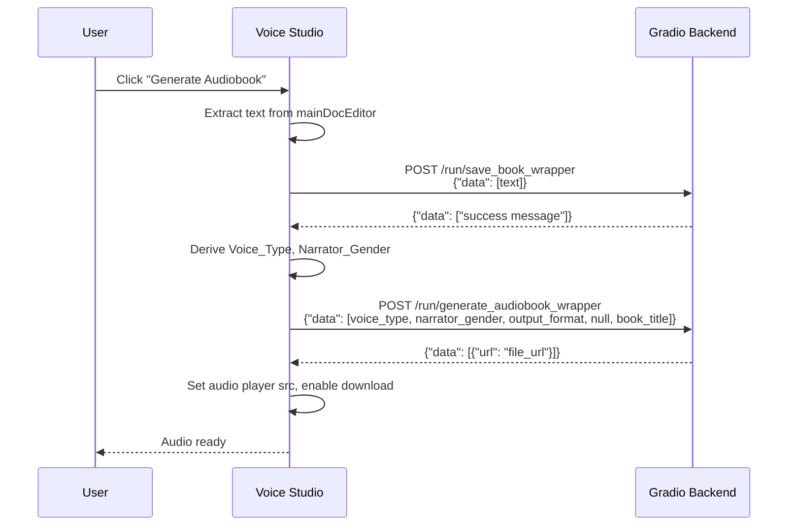
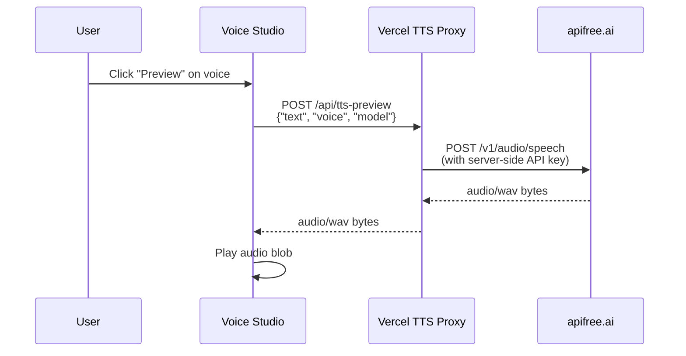

# Design Document: Gradio API Integration

## Overview

This design rewires the `voice_studio_test.html` frontend from broken Flask `/api/*` endpoints to the correct Gradio `/run/<endpoint>` format on the Render backend, routes TTS voice preview through a Vercel serverless proxy (keeping the apifree API key server-side), and gracefully disables out-of-scope features (Nyxen chat, voice cloning).

The current HTML file contains ~1072 lines with all JS inline. The changes are purely frontend JavaScript rewiring — no backend modifications are in scope.

### Key Design Decisions

1. **Gradio call format**: All audiobook-related calls use `POST /run/<endpoint>` with `{"data": [...]}` body and expect `{"data": [...]}` responses.
2. **TTS Proxy on Vercel**: Voice preview and TTS tab route through a Vercel serverless function (`/api/tts-preview`) that proxies to `https://api.apifree.ai/v1/audio/speech`. The API key lives in Vercel env vars, never in frontend code.
3. **Graceful degradation**: Nyxen shows a "coming soon" message. Voice cloning shows "not available on remote service." No 404 calls are made.
4. **JSZip fallback**: DOCX upload attempts Gradio extraction first, falls back to existing client-side JSZip parsing on failure.

## Architecture

```mermaid
graph LR
    subgraph Browser
        VS[voice_studio_test.html]
    end

    subgraph Render
        G[Gradio Backend<br/>audiobook-creator.onrender.com]
        G1[/run/validate_book_upload]
        G2[/run/text_extraction_wrapper]
        G3[/run/save_book_wrapper]
        G4[/run/generate_audiobook_wrapper]
    end

    subgraph Vercel
        TP[TTS Proxy<br/>/api/tts-preview]
    end

    subgraph External
        AF[apifree.ai<br/>Kokoro TTS API]
    end

    VS -->|audiobook ops| G
    G --- G1 & G2 & G3 & G4
    VS -->|voice preview / TTS| TP
    TP -->|server-side, with API key| AF
```

### Request Flow: Audiobook Generation



### Request Flow: TTS Preview



## Components and Interfaces

### 1. URL Constants (top of `<script>` block)

Replace the current constants:

```javascript
// CURRENT (broken)
var RENDER_URL = 'https://audiobook-creator.onrender.com';
var WORKER_BASE = 'https://nyxen-video-worker.smcantrellbooks.workers.dev';
var NYXEN_WORKER = WORKER_BASE + '/chat';

// NEW
var GRADIO_BASE = 'https://audiobook-creator.onrender.com';
var TTS_PROXY_URL = 'https://www.smcantrellbooks.com/api/tts-preview';
```

`WORKER_BASE` and `NYXEN_WORKER` are removed entirely. `RENDER_URL` is renamed to `GRADIO_BASE` for clarity.

### 2. Gradio API Helper

A shared helper function for all Gradio calls:

```javascript
async function gradioCall(endpoint, dataArray) {
  const resp = await fetch(GRADIO_BASE + '/run/' + endpoint, {
    method: 'POST',
    headers: { 'Content-Type': 'application/json' },
    body: JSON.stringify({ data: dataArray })
  });
  if (!resp.ok) {
    const errText = await resp.text();
    throw new Error('Gradio ' + endpoint + ' failed (' + resp.status + '): ' + errText.substring(0, 200));
  }
  const json = await resp.json();
  if (json.error) throw new Error(json.error);
  return json.data;
}
```

### 3. TTS Proxy Helper

A shared helper for TTS calls through the Vercel proxy:

```javascript
async function ttsProxyCall(text, voiceId) {
  const resp = await fetch(TTS_PROXY_URL, {
    method: 'POST',
    headers: { 'Content-Type': 'application/json' },
    body: JSON.stringify({
      text: text.substring(0, 2000),
      voice: voiceId,
      model: 'hexgrad/kokoro-tts/american-english'
    })
  });
  if (!resp.ok) throw new Error('TTS proxy returned ' + resp.status);
  const ct = resp.headers.get('content-type') || '';
  if (ct.includes('audio') || ct.includes('octet')) {
    return URL.createObjectURL(await resp.blob());
  }
  const errData = await resp.json();
  throw new Error(errData.error || 'No audio returned');
}
```

### 4. Rewired Functions

| Function | Current Endpoint | New Target | Notes |
|---|---|---|---|
| `generateAudiobook()` | `/api/generate-audiobook` | `gradioCall('save_book_wrapper', [...])` then `gradioCall('generate_audiobook_wrapper', [...])` | Two-step: save text, then generate |
| `previewVoice(slot)` | `/api/speak` | `ttsProxyCall(text, voiceId)` | Through Vercel proxy |
| `generateTTS()` | `/api/speak` | `ttsProxyCall(text, voiceId)` | Through Vercel proxy |
| `handleFileUpload` → `processFile()` | Client-side only | `gradioCall('validate_book_upload', [...])` then `gradioCall('text_extraction_wrapper', [...])` with JSZip fallback | Gradio first, JSZip fallback |
| `exportToAudio()` | N/A (no backend call) | Adds `gradioCall('save_book_wrapper', [...])` | Save text to Gradio session |
| `nyxenSend()` | `/api/chat` | Disabled, shows "coming soon" | No backend call |
| `speakNyxenReply()` | `/api/speak` | Disabled (no-op) | No backend call |
| `toggleNyxenMic()` | `/api/transcribe` | Disabled, shows message | No backend call |
| `handleCloneUpload()` | `/api/upload-mp3` | Shows "not available" message | No backend call |

### 5. Gender and Voice Type Derivation

Two pure functions extracted for testability:

```javascript
function deriveNarratorGender(voiceId) {
  if (!voiceId) return 'female';
  var prefix = voiceId.substring(0, 3);
  return (prefix === 'am_' || prefix === 'bm_') ? 'male' : 'female';
}

function deriveVoiceType(voice1Id, voice2Id) {
  if (!voice2Id || voice1Id === voice2Id) return 'Single Voice';
  return 'Multi-Voice';
}
```

### 6. Vercel Serverless Function: `/api/tts-preview`

Located at `api/tts-preview.js` (or `.ts`) in the Vercel project (smcantrellbooks/Cantrell-Creatives repo):

```javascript
// api/tts-preview.js
export default async function handler(req, res) {
  if (req.method === 'OPTIONS') {
    res.setHeader('Access-Control-Allow-Origin', '*');
    res.setHeader('Access-Control-Allow-Methods', 'POST, OPTIONS');
    res.setHeader('Access-Control-Allow-Headers', 'Content-Type');
    return res.status(200).end();
  }
  if (req.method !== 'POST') return res.status(405).json({ error: 'Method not allowed' });

  const { text, voice, model } = req.body;
  if (!text) return res.status(400).json({ error: 'No text provided' });

  const apiKey = process.env.KOKORO_API_KEY;
  if (!apiKey) return res.status(500).json({ error: 'TTS not configured' });

  const upstream = await fetch('https://api.apifree.ai/v1/audio/speech', {
    method: 'POST',
    headers: {
      'Authorization': 'Bearer ' + apiKey,
      'Content-Type': 'application/json'
    },
    body: JSON.stringify({
      model: model || 'hexgrad/kokoro-tts/american-english',
      input: text.substring(0, 2000),
      voice: voice || 'af_heart'
    })
  });

  if (!upstream.ok) {
    const errText = await upstream.text();
    return res.status(upstream.status).json({ error: 'TTS API error', detail: errText.substring(0, 200) });
  }

  const audioBuffer = Buffer.from(await upstream.arrayBuffer());
  res.setHeader('Content-Type', 'audio/wav');
  res.setHeader('Access-Control-Allow-Origin', '*');
  return res.status(200).send(audioBuffer);
}
```

Environment variable `KOKORO_API_KEY` must be set in Vercel project settings.

## Data Models

### Gradio Request/Response Format

All Gradio endpoints use the same envelope:

**Request:**
```json
{ "data": [param1, param2, ...] }
```

**Response (success):**
```json
{ "data": [result1, result2, ...] }
```

**Response (error):**
HTTP non-200 status, or JSON body with `"error"` field.

### Endpoint Signatures

| Endpoint | Parameters (positional in `data` array) | Response `data` |
|---|---|---|
| `validate_book_upload` | `[file_path, book_title]` | `[validation_message]` |
| `text_extraction_wrapper` | `[file_path, "textract"]` | `[extracted_text]` |
| `save_book_wrapper` | `[text_content]` | `[confirmation_message]` |
| `generate_audiobook_wrapper` | `[voice_type, narrator_gender, output_format, book_file_or_null, book_title]` | `[file_url_or_object]` |

### Voice Data Model (unchanged)

```javascript
{
  id: 'af_alloy',        // Voice ID — prefix determines gender
  name: 'Alloy',         // Display name
  style: 'Versatile & Clear',  // Style description
  gender: 'F',           // Display gender
  provider: 'kokoro82m'  // Engine: 'kokoro82m' or 'piper'
}
```

### Gender Derivation Rules

| Voice ID Prefix | Narrator_Gender |
|---|---|
| `af_` | `"female"` |
| `bf_` | `"female"` |
| `am_` | `"male"` |
| `bm_` | `"male"` |

### Voice Type Derivation Rules

| Condition | Voice_Type |
|---|---|
| Voice 1 === Voice 2 | `"Single Voice"` |
| Only Voice 1 selected | `"Single Voice"` |
| Voice 1 !== Voice 2 | `"Multi-Voice"` |

### TTS Proxy Request

```json
{
  "text": "string (max 2000 chars)",
  "voice": "af_heart",
  "model": "hexgrad/kokoro-tts/american-english"
}
```

### TTS Proxy Response

- Success: raw `audio/wav` bytes
- Error: `{ "error": "message", "detail": "optional" }`


## Correctness Properties

### Property 1: Narrator gender derivation from voice ID prefix

*For any* voice ID string, `deriveNarratorGender` should return `"male"` if the ID starts with `am_` or `bm_`, and `"female"` otherwise (including IDs starting with `af_`, `bf_`, or any other prefix).

**Validates: Requirements 1.5**

### Property 2: Voice type derivation from voice pair

*For any* pair of voice IDs (voice1, voice2), `deriveVoiceType` should return `"Single Voice"` when voice2 is falsy or equal to voice1, and `"Multi-Voice"` when voice1 and voice2 are both truthy and different.

**Validates: Requirements 1.6**

### Property 3: Gradio call helper formats requests and parses responses correctly

*For any* endpoint name and array of parameters, `gradioCall` should send a POST request with `Content-Type: application/json` and body `{"data": [...params]}`, and for any successful response with `{"data": [...]}`, it should return the data array. For any non-200 response or response with an `"error"` field, it should throw an error.

**Validates: Requirements 8.1, 8.2, 8.3, 8.4**

### Property 4: Generate audiobook assembles correct Gradio parameters

*For any* combination of voice1 ID, voice2 ID, output format, and book title, the `generateAudiobook` function should call `generate_audiobook_wrapper` with a data array of exactly `[derivedVoiceType, derivedNarratorGender, outputFormat, null, bookTitle]` where `derivedVoiceType` and `derivedNarratorGender` match the outputs of `deriveVoiceType` and `deriveNarratorGender` respectively.

**Validates: Requirements 1.2, 1.5, 1.6**

### Property 5: No Flask endpoint references in source code

*For any* version of the rewired `voice_studio_test.html`, the source code should contain zero occurrences of the strings `/api/speak`, `/api/generate-audiobook`, `/api/chat`, `/api/upload-mp3`, `/api/transcribe`, `WORKER_BASE`, or `NYXEN_WORKER` as live endpoint paths or constants.

**Validates: Requirements 7.1, 7.2, 4.3, 4.4, 9.2**

### Property 6: TTS operations route through proxy with text truncation

*For any* text string and voice ID, both `previewVoice` and `generateTTS` should send requests to `TTS_PROXY_URL` (not to any `/api/speak` endpoint), and the text in the request body should be at most 2000 characters long.

**Validates: Requirements 5.1, 6.1**

### Property 7: TXT file loading bypasses Gradio backend

*For any* file with a `.txt` extension, the `processFile` function should load the file using the client-side FileReader API and should not make any Gradio API calls.

**Validates: Requirements 2.5**

## Error Handling

### Gradio Backend Errors

| Scenario | Handling |
|---|---|
| `/run/save_book_wrapper` fails | Display error in `genStatus`, re-enable generate button. User can retry. |
| `/run/generate_audiobook_wrapper` fails | Display error in `genStatus`, re-enable generate button. Progress bar resets. |
| `/run/validate_book_upload` fails | Fall back to client-side JSZip DOCX parsing. Show info message. |
| `/run/text_extraction_wrapper` fails | Fall back to client-side JSZip DOCX parsing. Show info message. |
| Gradio returns non-JSON | `gradioCall` catches and throws with status code + response text snippet. |
| Network timeout / CORS error | Caught by try/catch, displayed in relevant status area. |

### TTS Proxy Errors

| Scenario | Handling |
|---|---|
| Proxy returns non-200 | Alert "voice preview temporarily unavailable" for preview; show error in `ttsStatus` for TTS tab. |
| Proxy returns non-audio content-type | Parse as JSON, extract error message, display to user. |
| Proxy unreachable | Caught by try/catch, alert or status message shown. |

### Disabled Feature Errors

| Feature | Handling |
|---|---|
| Nyxen chat send | Show "Nyxen is being rebuilt as an independent app and will return soon" in the feed. No fetch call. |
| Nyxen mic | Show message in feed. No fetch call. |
| Nyxen voice playback | No-op. No fetch call. |
| Voice cloning upload | Show "Voice cloning is not yet available on the remote service" in `cloneStatus`. No fetch call. |

### General Patterns

- All async functions use try/catch blocks
- Error messages are displayed in the nearest status element using `showStatus(id, 'err', message)`
- Buttons are re-enabled in both success and error paths (finally-style pattern)
- Progress bars reset to 0% on error

## Testing Strategy

### Unit Tests

- **Gender derivation examples**: Verify `deriveNarratorGender('af_alloy')` → `'female'`, `deriveNarratorGender('am_adam')` → `'male'`, `deriveNarratorGender('bm_daniel')` → `'male'`, `deriveNarratorGender('bf_emma')` → `'female'`
- **Voice type examples**: Verify `deriveVoiceType('af_alloy', 'am_adam')` → `'Multi-Voice'`, `deriveVoiceType('af_alloy', 'af_alloy')` → `'Single Voice'`, `deriveVoiceType('af_alloy', null)` → `'Single Voice'`
- **Gradio helper error handling**: Mock fetch to return 500, verify error is thrown with status code
- **Nyxen disabled**: Verify `nyxenSend()` does not call fetch, adds "coming soon" message to feed
- **Voice cloning disabled**: Verify `handleCloneUpload()` shows "not available" message, does not call fetch
- **JSZip fallback**: Mock Gradio upload failure, verify JSZip path is taken
- **URL constants**: Verify `GRADIO_BASE` and `TTS_PROXY_URL` are defined, no `RENDER_URL`, `WORKER_BASE`, or `NYXEN_WORKER`

### Property-Based Tests

Property-based tests verify universal properties across randomized inputs. Use **fast-check** as the PBT library (JavaScript, browser-compatible).

Each property test must:
- Run a minimum of 100 iterations
- Reference its design document property with a tag comment
- Use `fc.assert(fc.property(...))` pattern

| Property | Generator Strategy |
|---|---|
| P1: Gender derivation | Generate random strings with prefixes from `{af_, bf_, am_, bm_, xx_, ""}` + random suffix |
| P2: Voice type derivation | Generate pairs of `(string \| null, string \| null)` voice IDs |
| P3: Gradio call format | Generate random endpoint names and arrays of mixed-type parameters; mock fetch |
| P4: Parameter assembly | Generate random voice IDs, output formats from the valid set, and book title strings |
| P5: No Flask references | Static analysis — scan source string for forbidden patterns (single test, not randomized) |
| P6: TTS proxy routing | Generate random text strings (including >2000 chars) and voice IDs; mock fetch to verify target URL and truncation |
| P7: TXT bypass | Generate random file objects with `.txt` extension; mock fetch to verify it's never called |